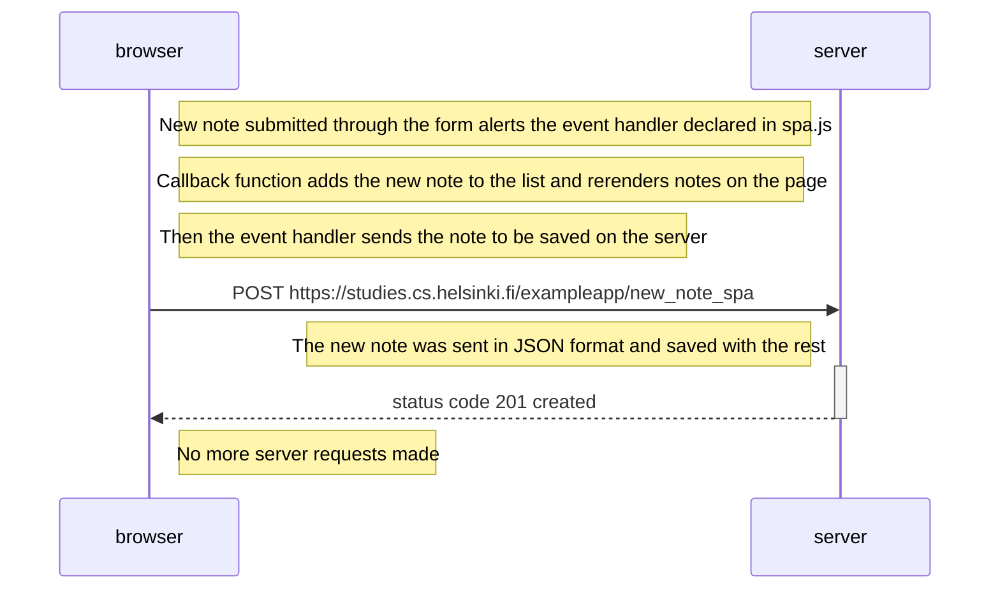

```mermaid
sequenceDiagram
    participant browser
    participant server

    Note right of browser: New note submitted through the form alerts the event handler declared in spa.js
    Note right of browser: Callback function adds the new note to the list and rerenders notes on the page
    Note right of browser: Then the event handler sends the note to be saved on the server

    browser->>server: POST https://studies.cs.helsinki.fi/exampleapp/new_note_spa
    Note left of server: The new note was sent in JSON format and saved with the rest
    activate server
    server-->>browser: status code 201 created
    deactivate server

    Note right of browser: No more server requests made
```
